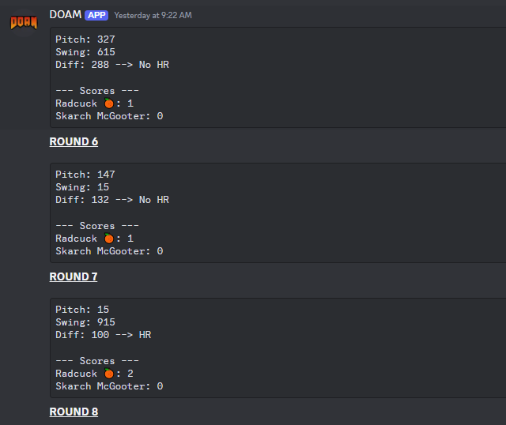

<br />
<div align="center">
  <a href="https://github.com/veritablequandary/doam">
    
  </a>

  <p align="center">
    DOAM is a Discord bot for running and managing DOAM, Major League Redditball's Home Run Derby-style number guessing game.
  </p>
</div>

## About

<a>  </a>

DOAM supports:
- One active match per Discord server (games can be run in multiple servers concurrently)
- Per-server configuration - restrict games to a single channel, restrict game management to a specific Discord role, and use a fun role to announce when new games start!
- Discord slash commands. This bot will not read message content on your server - EVER.

## Getting Started

### Prerequisites

- Node.js (any reasonably current version should work fine)
- Axiom.co account (for optional structured logging output)

### Installation

1. Clone or download a copy of this repository
   ```sh
   git clone https://github.com/veritablequandary/doam.git
   ```
3. Install NPM packages
   ```sh
   npm install
   ```
4. Add the following variables to your environment:
   ```
   DISCORD_TOKEN = 'Your Discord application token'
   DISCORD_APPID = 'Your Discord application ID'
   *DISCORD_INVITELINK = 'Your Discord bot's invite link'
   *AXIOM_DATASET = 'Your Axiom ingest dataset name'
   *AXIOM_TOKEN = 'Your Axiom ingest token'

   ```
   \* denotes an optional variable

## Roadmap

- [ ] Additional / custom rule sets
- [ ] Tournament support

## License

Distributed under the MIT License. See `LICENSE.txt` for more information.

## Contact

If you have questions, comments, feature requests, bugs, etc. please let me know!

Development Discord: [DOAM Discord](https://discord.gg/invite/rWfEKbnVtx)

 - Discord @veritablequandary
 - MLR Main Discord (Sterling Turlington)